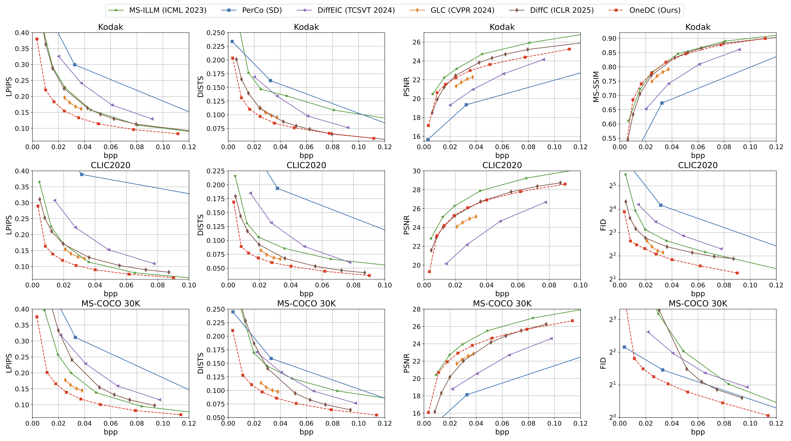

## One-Step Diffusion-Based Image Compression with Semantic Distillation
### NeurIPS 2025

[](https://arxiv.org/abs/2505.16687)
[](https://onedc-codec.github.io/) 
[](https://www.python.org/downloads/release/python-3100/)
[](https://pytorch.org/get-started/locally/) 

Naifu Xue, Zhaoyang Jia, Jiahao Li, Bin Li, Yuan Zhang, Yan Lu


## 👍 More Works
- [DLF: Extreme Image Compression with Dual-generative Latent Fusion (ICCV 2025 Highlight)](https://github.com/dlfcodec/Dual-generative-Latent-Fusion)


## 📝 Abstract
While recent diffusion-based generative image codecs have shown impressive performance, their iterative sampling process introduces unpleasant latency. In this work, we revisit the design of a diffusion-based codec and argue that multi-step sampling is not necessary for generative compression. Based on this insight, we propose OneDC, a One-step Diffusion-based generative image Codec—that integrates a latent compression module with a one-step diffusion generator. Recognizing the critical role of semantic guidance in one-step diffusion, we propose using the hyperprior as a semantic signal, overcoming the limitations of text prompts in representing complex visual content. To further enhance the semantic capability of the hyperprior, we introduce a semantic distillation mechanism that transfers knowledge from a pretrained generative tokenizer to the hyperprior codec. Additionally, we adopt a hybrid pixel- and latent-domain optimization to jointly enhance both reconstruction fidelity and perceptual realism. Extensive experiments demonstrate that OneDC achieves SOTA perceptual quality even with one-step generation, offering over 39% bitrate reduction and 20×faster decoding compared to prior multi-step diffusion-based codecs. Project: https://onedc-codec.github.io/


⬆️ (Top) Multi-step sampling is not essential for image compression, One-Step is enough. (Bottom) Visual examples.


⬆️ OneDC can compress images to text-level size (a 768x768 image with 0.24KB), but the reconstruction still retains strong semantic consistency and original spatial details.
(a) Text prompts (from GPT-4o) struggle to capture complex visual semantics, and existing text-to-image models have limited generation fidelity. (b) Hyperprior guidance yields more faithful reconstructions. (c) Semantic distillation further improves object-level accuracy.


⬆️ Framework overview.


⬆️ Quantitative evaluation.

## 💿 Installation

**1. Create environment & install dependencies**
```bash
conda create -n onedc python=3.10
conda activate onedc
```
Then, install PyTorch 2.5.0 manually according to your CUDA version.
Finally, install required packages:
```bash
pip install -r requirements.txt
```

Notes:
- You may need to downgrade pip to v24.0.

**2. Build the entropy coder**

```bash
sudo apt-get install cmake g++
cd src
mkdir build
cd build
conda activate $YOUR_PY38_ENV_NAME
cmake ../cpp -DCMAKE_BUILD_TYPE=Release[Debug]
make -j
```

## 💻 Inference
Running coding process:

1. Download [our model weights](https://1drv.ms/f/c/af332a47fcf136b4/IgB2AkqLGTK_SakjT-Z0lytcAUVZWCL8BFdm1ftdU2DiAjU?e=5z3E4y) (lambda 12.2~0.6 model)
2. Run inference script:
```bash
cd src
python inference.py \
    --config_path config_inference.yaml \
    --checkpoint_path [checkpoint path] \
    --eval_image_path [your image folder] \
    --output_path [output folder] \
```

- For 0.0034 bpp model (exlow_bpp0034 model), use inference script in src/models/sd15_onedc_codec_z_only:
```bash
cd src
python models/sd15_onedc_codec_z_only/inference.py \
    --config_path config_inference.yaml \
    --checkpoint_path [checkpoint path] \
    --eval_image_path [your image folder] \
    --output_path [output folder] \
```

Evaluating quality:
```bash
cd src
python test_quality.py \
    --ref [your image folder] \
    --recon [recon image folder] \
    --fid_patch_size 256 \
    --fid_patch_num 2 \
    --output_path [result output folder] \
    --output_name [result output name]
```


## 🚀 Train
1. Prepare pretrained models: [Pretrained one-step generator](https://huggingface.co/tianweiy/DMD2/blob/main/model/sdv1.5/laion6.25_sd_baseline_8node_guidance1.75_lr5e-7_seed10_dfake10_diffusion1000_gan1e-3_resume_fid8.35_checkpoint_model_041000/pytorch_model.bin) and [VQGAN Tokenizer](https://1drv.ms/f/c/af332a47fcf136b4/IgB2AkqLGTK_SakjT-Z0lytcAUVZWCL8BFdm1ftdU2DiAjU?e=5z3E4y)

2. Prepare dataset
  - Download [commoncatalog-cc-by-nd](https://huggingface.co/datasets/common-canvas/commoncatalog-cc-by-nd) by script:
    ```bash
    cd src
    python get_cc_dataset.py -d [your download folder]
    ```
    Notes:
    - You may need to use "export HF_DATASETS_CACHE=" to change the HF cache dir, according to your disk space.

    The 
    ```bash
    [your download folder]/common-canvas___commoncatalog-cc-by-nd/default/0.0.0/3991ff88ebf48e0435ec8d044d2f4b159f4f716e
    ```
    contains downloaded data file, e.g., "commoncatalog-cc-by-nd-train-00000-of-10447.arrow" and "dataset_info.json".

  - Prepare your validation dataset.

    We use [COCO 2017 dataset](https://cocodataset.org/#download). You need to prepare annotations/captions_val2017.json and val2017 image set.

  - Update the training config with the pretrained model and dataset path.

3. Stage I training
    ```bash
    cd src
    accelerate launch --config_file ddp_configs/ddp_4A100.yaml \
      models/sd15_onedc_codec_stage1/train_sd15_codec_stage1.py \
      --config_path models/sd15_onedc_codec_stage1/configs/config_sd15_onedc_lmbda4.6_stage1_lr5e-5.yaml \
    ```
4. Stage II training
    ```bash
    cd src
    accelerate launch --config_file ddp_configs/ddp_4A100.yaml \
      models/sd15_onedc_codec_stage2/train_sd15_codec_stage2.py \
      --config_path models/sd15_onedc_codec_stage2/configs/config_sd15_onedc_lmbda4.6_stage2_lr1e-6.yaml \
    ```
  
Notes:
- Adjust the lambda strategy in config to reach your target bitrate.
- For better results, you may need to manually decrease learning rate and continue training.


## 🥰 Acknowledgement
We sincerely thank the following outstanding works, which greatly inspired and supported our research:
- [Improved Distribution Matching Distillation for Fast Image Synthesis](https://github.com/tianweiy/DMD2)
- [MaskGIT: Masked Generative Image Transformer](https://github.com/google-research/maskgit)
- [DCVC family](https://github.com/microsoft/DCVC)


## 📕 Citation

If you find our work inspiring, please cite:
```bibtex
@inproceedings{xue2025one,
  title={One-Step Diffusion-Based Image Compression with Semantic Distillation},
  author={Naifu Xue and Zhaoyang Jia and Jiahao Li and Bin Li and Yuan Zhang and Yan Lu},
  booktitle={The Thirty-ninth Annual Conference on Neural Information Processing Systems},
  year={2025},
}
```


## ⚖️ License

This project as a whole is licensed under CC BY-NC-SA 4.0.

It incorporates third-party components:
- DMD2: CC BY-NC-SA 4.0 (folder: src/modules/dmd)
- VQGAN: Apache License 2.0 (folder: src/modules/vqgan)
- DCVC: MIT License (file: src/modules/dcvc.py;  folder: src/modules/entropy)

